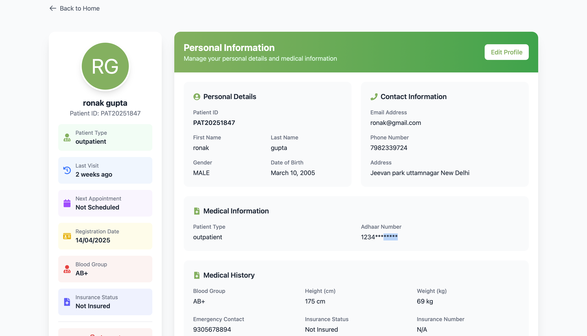
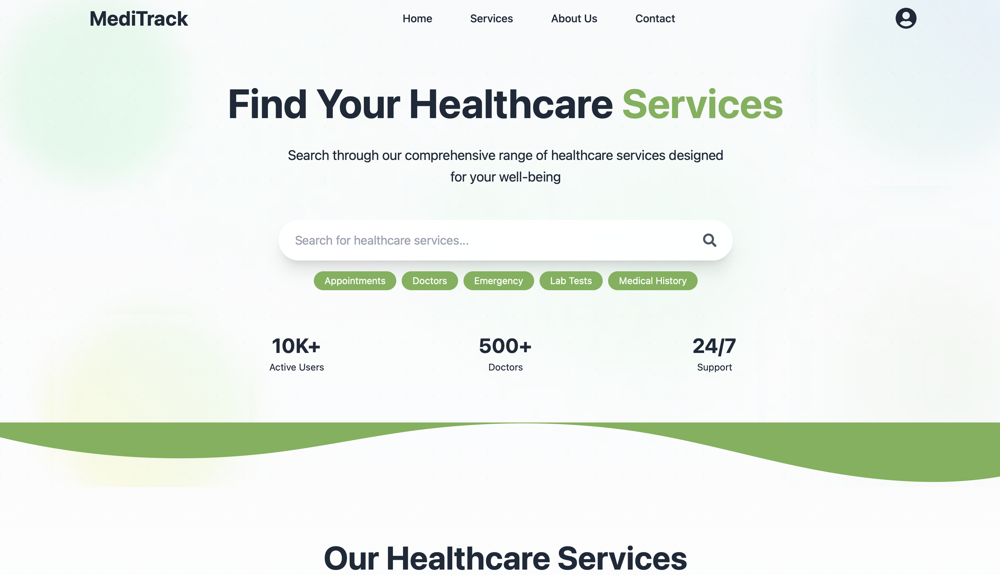
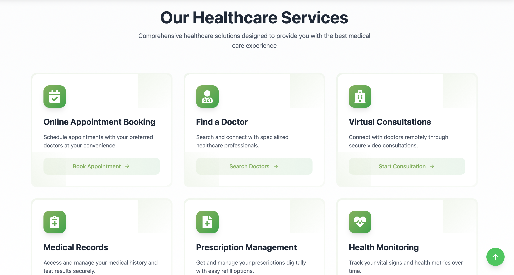

# commands to run the backend and frontend on both macOS and Windows

📦 Backend (Django)

    ✅ 1. Setup Virtual Environment
    
    Only if env/ folder doesn't exist --
    
    For -- macOS / Linux:
            
            >> python3 -m venv env
            >> source env/bin/activate
    
    For -- Windows (Command Prompt):
    
            >> python -m venv env
            >> env\Scripts\activate
    
    For -- Windows (PowerShell):
    
            >> python -m venv env
            >> .\env\Scripts\Activate.ps1
    
    
    ✅ 2. Install Dependencies
        # Navigate to the backend folder
            >> cd backend 
    
        #Then install Python packages:
            >> pip install -r requirement.txt
            >> pip install pymysql
    
    🔁 Note: The file is typically named requirements.txt — if yours is requirement.txt, ensure it's consistent.
    
    ✅ 3. Run Django Development Server
    
            >> python manage.py runserver
    
    🔁 You can now access your backend 

🌐 Frontend (React / Vite)

    ✅ 1. Install Dependencies
       # Navigate to the frontend directory:
            >> cd frontend
            >> npm install
    ✅ 2. Run the Dev Server
            >> npm run dev

    🔁 This starts the frontend server 

🛠️ Tools & Technologies Used
    
    🌐 Frontend

        React.js – For building fast and interactive UI
        Vite – Lightning-fast development server and optimized builds
        Tailwind CSS  – For modern and responsive styling
        Axios – For making HTTP requests to the backend

        what it handles ? 

           >> This is the user interface built using React.js with Vite as the build tool for faster performance.
           >> Users perform actions like booking appointments, viewing reports, or managing profiles.
           >>  All actions on the frontend are translated into API calls sent to the backend.

    ⚙️ Backend

        Django (Python) – Powerful web framework for rapid backend development
        Django REST Framework – To build secure, robust RESTful APIs
        PyMySQL – To connect Django with MySQL database
        Simple JWT – For token-based authentication

        what it handles ? 
        The backend handles all business logic.

           >> It receives requests from the frontend and performs tasks like:
           >> User authentication and authorization
           >> Processing appointments and lab tests
           >> Reading/writing to the database

    🗃️ Database

        MySQL – Relational database used to store healthcare data (patients, doctors, appointments, etc.)

        what it handles ? 
        Data is stored in a MySQL relational database.

         >> It contains structured tables for:
                Patients 
                Doctors
                Appointments
                Lab Tests
                Billing
                Emergency records
                Consultancy and more

    ☁️ Cloud :

        AWS (Amazon Web Services)  – For future deployment or storage solutions
        
        ✅ Why AWS?
        AWS provides a robust infrastructure with global availability, secure data storage, and tools for seamless deployment and management — ideal for healthcare systems.

🔁 Workflow : 

   >> User Interaction:
        The user sends a request via the browser (e.g., login, fetch data, submit form).
    
   >> Frontend Request:
        The frontend application (built with React) captures the user action and sends an API request to the backend server.
    
   >> Backend Processing:
        The backend (Django) receives the API request, processes it according to business logic, and interacts with the AWS RDS database to read or write data.
    
   >> Database Interaction:
        The AWS RDS (Relational Database Service) securely stores and manages your project’s data. The backend queries or updates data in the RDS instance as needed.
    
   >> Response to Frontend:
        The backend sends the processed response data back to the frontend via the API.
    
   >> Frontend Display:
        The frontend receives the response and dynamically updates the UI to display the results to the user.

### Appointment Booking UI
>>Home Page

>>Profile Page

>>Services Page
 

>>Book Appointment Page
